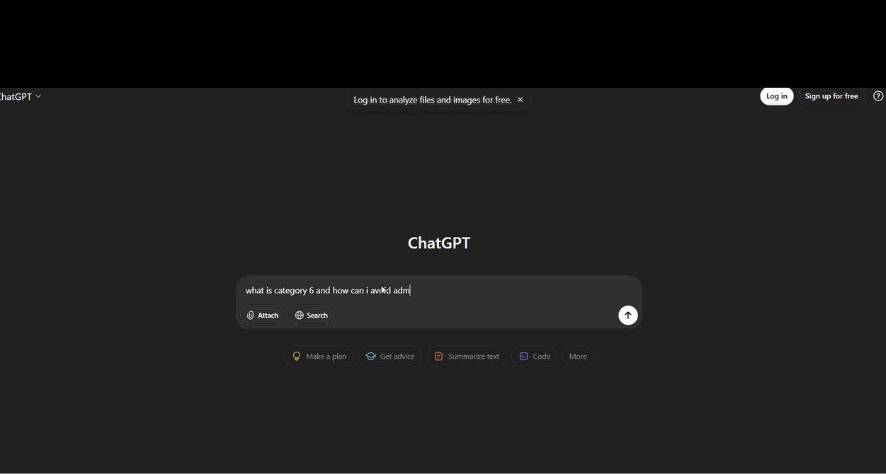
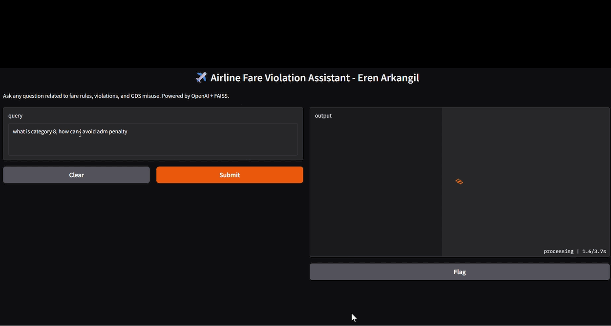

# ✈️ FareGuard.AI  


**RAG-Based Personalized Chatbot for Airlines and Travel Agencies**


---

## 🌍 Overview

FareGuard.AI acts as a **knowledge assistant** for airline revenue management, fare audit, and ticketing teams.  
It retrieves and interprets official rule documentation to provide reliable, contextual responses.

While general LLMs like ChatGPT are powerful, they often hallucinate or fail in highly specialized, rule-based contexts such as ATPCO fare rules.


💡 **Mission:** Prevent misinformation and reduce costly fare violations by giving agents an AI that truly understands fare rules.

---

## 🧠 How It Works

FareGuard.AI is powered by a **Retrieval-Augmented Generation (RAG)** pipeline:

1. **Data Collection:**  
   Publicly available airline policies, ATPCO, IATA, and GDS documentation are collected and cleaned.  

2. **Vectorization:**  
   Documents are split into logical chunks and converted into vector embeddings stored in a **FAISS** database.  

3. **Retrieval + Generation:**  
   When a user asks a question, FareGuard retrieves the most relevant text chunks and combines them with **transformer** models for grounded, context-aware responses.  

4. **Flask UI:**  
   A web-based interface allows users to ask fare-related questions interactively.  

🔎 **Why RAG?**  
RAG reduces hallucinations and ensures responses are  **factual**, and **contextually grounded**, reducing risk of **millions in potential ADM losses** across the industry.

---

## 🧩 Tech Stack

| Component | Description |
|------------|-------------|
| **Frontend** | Flask (HTML/CSS templates) |
| **LLM Backend** | OpenAI models *(modular design — can integrate local LLMs like Llama or Mistral)* |
| **Retriever** | FAISS vector database |
| **Embeddings** | OpenAI embeddings  / Sentence Transformers (e.g., `all-MiniLM-L6-v2`)   |
| **Processing Framework** | LangChain |
| **Data Source** | ATPCO, IATA, GDS rule documentation |

---

## 💬 Example Query

**User:**  
> “What is Category 6, and how can travel agents avoid getting ADM penalties?”

### 🤖 ChatGPT’s Response  
> “I’m not sure. It depends on the airline’s fare policy.”

### ✈️ FareGuard.AI’s Response  
> “Category 6 refers to *minimum stay requirements* within ATPCO fare rules.  
> Agents must ensure the outbound and inbound segments meet the published minimum stay to avoid violations.  
> Failing to comply may trigger ADM penalties under ATPCO Cat 16 (Penalties) or IATA Resolution 850m.”

---

## 🎥 Demo & Comparison

Below is a side-by-side demo showing the same query asked to **ChatGPT** and **FareGuard.AI**.

| ChatGPT | FareGuard.AI |
|:--------:|:-------------:|
|  |  |


---

## 🧰 Local Setup

```bash
git clone https://github.com/erenarkangil/fareguard-ai.git
cd fareguard-ai
pip install -r requirements.txt
cp .env.example .env   # add your OpenAI API key
python main.py
